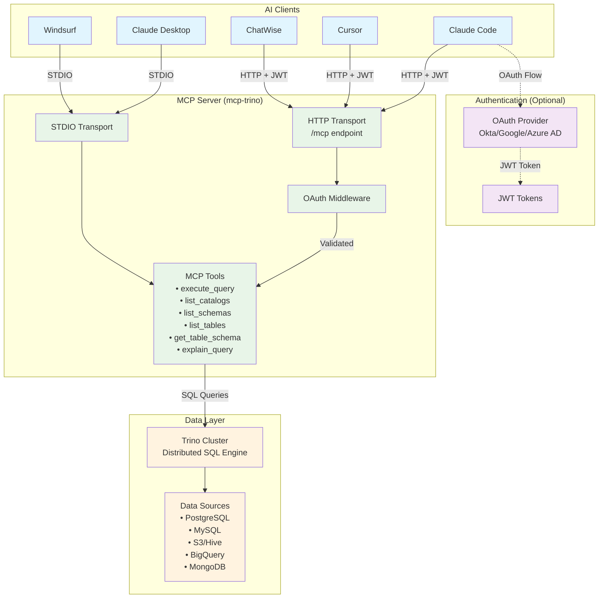

# Trino MCP Server in Go

A high-performance Model Context Protocol (MCP) server for Trino implemented in Go. This project enables AI assistants to seamlessly interact with Trino's distributed SQL query engine through standardized MCP tools.

[](https://github.com/tuannvm/mcp-trino/actions/workflows/build.yml)
[](https://github.com/tuannvm/mcp-trino/blob/main/go.mod)
[](https://github.com/tuannvm/mcp-trino/actions/workflows/build.yml)
[](https://slsa.dev)
[](https://goreportcard.com/report/github.com/tuannvm/mcp-trino)
[](https://pkg.go.dev/github.com/tuannvm/mcp-trino)
[](https://github.com/tuannvm/mcp-trino/pkgs/container/mcp-trino)
[](https://github.com/tuannvm/mcp-trino/releases/latest)
[](https://opensource.org/licenses/MIT)

[](https://archestra.ai/mcp-catalog/tuannvm__mcp-trino)

## Overview

This project implements a Model Context Protocol (MCP) server for Trino in Go. It enables AI assistants to access Trino's distributed SQL query engine through standardized MCP tools.

Trino (formerly PrestoSQL) is a powerful distributed SQL query engine designed for fast analytics on large datasets.

## Architecture



**Key Components:**

- **AI Clients**: Various MCP-compatible applications
- **Authentication**: Optional OAuth 2.0 with OIDC providers
- **MCP Server**: Go-based server with dual transport support
- **Data Layer**: Trino cluster connecting to multiple data sources

## Features

- ✅ MCP server implementation in Go
- ✅ Trino SQL query execution through MCP tools
- ✅ Catalog, schema, and table discovery
- ✅ Docker container support
- ✅ Supports both STDIO and HTTP transports
- ✅ OAuth 2.0 authentication with OIDC provider support (Okta, Google, Azure AD)
- ✅ StreamableHTTP support with JWT authentication (upgraded from SSE)
- ✅ Backward compatibility with SSE endpoints
- ✅ Compatible with Cursor, Claude Desktop, Windsurf, ChatWise, and any MCP-compatible clients.

## Installation & Quick Start

**Install:**

```bash
# Homebrew
brew install tuannvm/mcp/mcp-trino

# Or one-liner (macOS/Linux)
curl -fsSL https://raw.githubusercontent.com/tuannvm/mcp-trino/main/install.sh | bash
```

**Run (Local Development):**

```bash
export TRINO_HOST=localhost TRINO_USER=trino
mcp-trino
```

For production deployment with OAuth, see [Deployment Guide](docs/deployment.md).

## Usage

**Supported Clients:** Claude Desktop, Claude Code, Cursor, Windsurf, ChatWise

**Available Tools:** `execute_query`, `list_catalogs`, `list_schemas`, `list_tables`, `get_table_schema`, `explain_query`

For client integration and tool documentation, see [Integration Guide](docs/integrations.md) and [Tools Reference](docs/tools.md).

## Configuration

**Key Variables:** `TRINO_HOST`, `TRINO_USER`, `TRINO_SCHEME`, `MCP_TRANSPORT`, `OAUTH_PROVIDER`

**Performance Optimization (NEW):**

```bash
# Focus AI on specific schemas only (10-20x performance improvement)
export TRINO_ALLOWED_SCHEMAS="hive.analytics,hive.marts,hive.reporting"
```

For complete configuration and allowlist setup, see [Deployment Guide](docs/deployment.md) and [Allowlists Guide](docs/allowlists.md).

## Contributing

Contributions are welcome! Please feel free to submit a Pull Request.

## License

This project is licensed under the MIT License - see the LICENSE file for details.

## CI/CD and Releases

This project uses GitHub Actions for continuous integration and GoReleaser for automated releases.

### Continuous Integration Checks

Our CI pipeline performs the following checks on all PRs and commits to the main branch:

#### Code Quality

- **Linting**: Using golangci-lint to check for common code issues and style violations
- **Go Module Verification**: Ensuring go.mod and go.sum are properly maintained
- **Formatting**: Verifying code is properly formatted with gofmt

#### Security

- **Vulnerability Scanning**: Using govulncheck to check for known vulnerabilities in dependencies
- **Dependency Scanning**: Using Trivy to scan for vulnerabilities in dependencies (CRITICAL, HIGH, and MEDIUM)
- **SBOM Generation**: Creating a Software Bill of Materials for dependency tracking
- **SLSA Provenance**: Creating verifiable build provenance for supply chain security

#### Testing

- **Unit Tests**: Running tests with race detection and code coverage reporting
- **Build Verification**: Ensuring the codebase builds successfully

#### CI/CD Security

- **Least Privilege**: Workflows run with minimum required permissions
- **Pinned Versions**: All GitHub Actions use specific versions to prevent supply chain attacks
- **Dependency Updates**: Automated dependency updates via Dependabot

### Release Process

When changes are merged to the main branch:

1. CI checks are run to validate code quality and security
2. If successful, a new release is automatically created with:
   - Semantic versioning based on commit messages
   - Binary builds for multiple platforms
   - Docker image publishing to GitHub Container Registry
   - SBOM and provenance attestation
