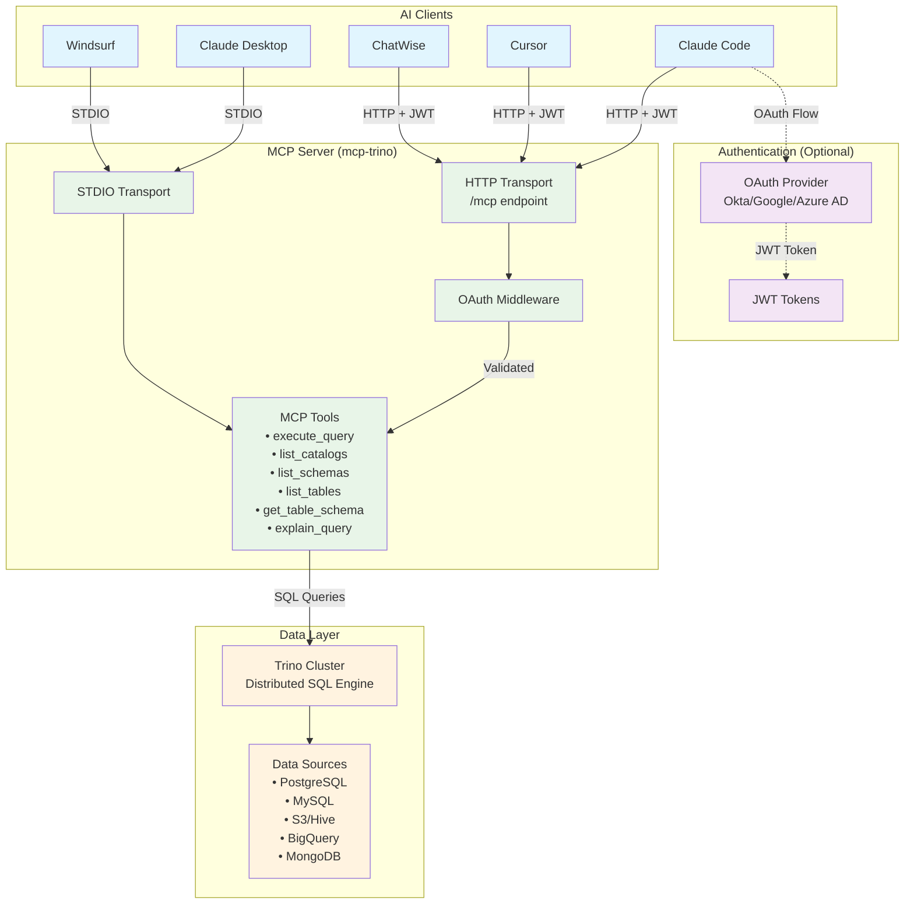

# Trino MCP Server in Go

A high-performance Model Context Protocol (MCP) server for Trino implemented in Go. This project enables AI assistants to seamlessly interact with Trino's distributed SQL query engine through standardized MCP tools.

[](https://github.com/tuannvm/mcp-trino/actions/workflows/build.yml)
[](https://github.com/tuannvm/mcp-trino/blob/main/go.mod)
[](https://github.com/tuannvm/mcp-trino/actions/workflows/build.yml)
[](https://slsa.dev)
[](https://goreportcard.com/report/github.com/tuannvm/mcp-trino)
[](https://pkg.go.dev/github.com/tuannvm/mcp-trino)
[](https://github.com/tuannvm/mcp-trino/pkgs/container/mcp-trino)
[](https://github.com/tuannvm/mcp-trino/releases/latest)
[](https://opensource.org/licenses/MIT)

[](https://archestra.ai/mcp-catalog/tuannvm__mcp-trino)

## Overview

This project implements a Model Context Protocol (MCP) server for Trino in Go. It enables AI assistants to access Trino's distributed SQL query engine through standardized MCP tools.

Trino (formerly PrestoSQL) is a powerful distributed SQL query engine designed for fast analytics on large datasets.

## Architecture



**Key Components:**

- **AI Clients**: Various MCP-compatible applications
- **Authentication**: Optional OAuth 2.0 with OIDC providers
- **MCP Server**: Go-based server with dual transport support
- **Data Layer**: Trino cluster connecting to multiple data sources

## Features

- ✅ MCP server implementation in Go
- ✅ Trino SQL query execution through MCP tools
- ✅ Catalog, schema, and table discovery
- ✅ Docker container support
- ✅ Supports both STDIO and HTTP transports
- ✅ OAuth 2.0 authentication with OIDC provider support (Okta, Google, Azure AD)
- ✅ StreamableHTTP support with JWT authentication (upgraded from SSE)
- ✅ Backward compatibility with SSE endpoints
- ✅ Compatible with Cursor, Claude Desktop, Windsurf, ChatWise, and any MCP-compatible clients.

## Installation

For detailed installation instructions, see [Installation Guide](docs/installation.md).

### Quick Start

**One-liner install (macOS/Linux):**

```bash
curl -fsSL https://raw.githubusercontent.com/tuannvm/mcp-trino/main/install.sh -o install.sh && chmod +x install.sh && ./install.sh
```

**Homebrew:**

```bash
brew install tuannvm/mcp/mcp-trino
```

**Manual download:** Get binaries from [GitHub Releases](https://github.com/tuannvm/mcp-trino/releases).

## Quick Start

### Local Development (No Authentication)

```bash
export TRINO_HOST=localhost
export TRINO_PORT=8080
export TRINO_USER=trino
mcp-trino
```

### Production with OAuth

```bash
export OAUTH_PROVIDER=okta
export OIDC_ISSUER=https://your-domain.okta.com
export OIDC_AUDIENCE=your-service-audience
export MCP_TRANSPORT=http
mcp-trino
```

For detailed deployment and authentication options, see [Deployment Guide](docs/deployment.md).

## MCP Client Integration

For detailed integration instructions with various MCP clients, see [Integration Guide](docs/integrations.md).

**Supported Clients:**

- Claude Desktop
- Claude Code
- Cursor
- Windsurf
- ChatWise

**Quick Example (Claude Desktop):**

```json
{
  "mcpServers": {
    "mcp-trino": {
      "command": "mcp-trino",
      "args": [],
      "env": {
        "TRINO_HOST": "<HOST>",
        "TRINO_PORT": "<PORT>",
        "TRINO_USER": "<USERNAME>",
        "TRINO_PASSWORD": "<PASSWORD>"
      }
    }
  }
}
```

## Available MCP Tools

For detailed tool documentation and examples, see [Tools Reference](docs/tools.md).

**Available Tools:**

- `execute_query` - Execute SQL queries
- `list_catalogs` - Discover data catalogs
- `list_schemas` - List schemas in catalogs
- `list_tables` - List tables in schemas
- `get_table_schema` - Get table structure
- `explain_query` - Analyze query execution plans

**Quick Example:**

```json
{
  "query": "SELECT region, COUNT(*) FROM tpch.tiny.customer GROUP BY region"
}
```

## Configuration

Key environment variables:

### Connection Settings
| Variable | Description | Default |
|----------|-------------|----------|
| TRINO_HOST | Trino server hostname | localhost |
| TRINO_PORT | Trino server port | 8080 |
| TRINO_USER | Trino user | trino |
| TRINO_SCHEME | Connection scheme (http/https) | https |
| MCP_TRANSPORT | Transport method (stdio/http) | stdio |
| OAUTH_PROVIDER | OAuth provider (hmac/okta/google/azure) | (empty) |
| OIDC_AUDIENCE | OIDC audience identifier | (empty) |

### Performance Optimization (NEW)

| Variable | Description | Default |
|----------|-------------|----------|
| TRINO_ALLOWED_CATALOGS | Comma-separated list of allowed catalogs | (empty - all catalogs allowed) |
| TRINO_ALLOWED_SCHEMAS | Comma-separated list of allowed schemas in `catalog.schema` format | (empty - all schemas allowed) |
| TRINO_ALLOWED_TABLES | Comma-separated list of allowed tables in `catalog.schema.table` format | (empty - all tables allowed) |

**Example Usage:**

```bash
# Focus Claude AI on specific schemas only (solves PE-7414 performance issue)
export TRINO_ALLOWED_SCHEMAS="hive.analytics,hive.marts,hive.reporting"

# Multi-level filtering for production environments
export TRINO_ALLOWED_CATALOGS="hive,postgresql"
export TRINO_ALLOWED_SCHEMAS="hive.analytics,hive.marts,postgresql.public"
export TRINO_ALLOWED_TABLES="hive.analytics.sensitive_users"
```

**Benefits:**
- **Performance**: Reduces Claude AI query time by limiting search scope
- **Focus**: Eliminates distractions from irrelevant data sources
- **Security**: Additional layer of access control (complements existing Trino security)

For complete configuration reference, see [Deployment Guide](docs/deployment.md).

## Contributing

Contributions are welcome! Please feel free to submit a Pull Request.

## License

This project is licensed under the MIT License - see the LICENSE file for details.

## CI/CD and Releases

This project uses GitHub Actions for continuous integration and GoReleaser for automated releases.

### Continuous Integration Checks

Our CI pipeline performs the following checks on all PRs and commits to the main branch:

#### Code Quality

- **Linting**: Using golangci-lint to check for common code issues and style violations
- **Go Module Verification**: Ensuring go.mod and go.sum are properly maintained
- **Formatting**: Verifying code is properly formatted with gofmt

#### Security

- **Vulnerability Scanning**: Using govulncheck to check for known vulnerabilities in dependencies
- **Dependency Scanning**: Using Trivy to scan for vulnerabilities in dependencies (CRITICAL, HIGH, and MEDIUM)
- **SBOM Generation**: Creating a Software Bill of Materials for dependency tracking
- **SLSA Provenance**: Creating verifiable build provenance for supply chain security

#### Testing

- **Unit Tests**: Running tests with race detection and code coverage reporting
- **Build Verification**: Ensuring the codebase builds successfully

#### CI/CD Security

- **Least Privilege**: Workflows run with minimum required permissions
- **Pinned Versions**: All GitHub Actions use specific versions to prevent supply chain attacks
- **Dependency Updates**: Automated dependency updates via Dependabot

### Release Process

When changes are merged to the main branch:

1. CI checks are run to validate code quality and security
2. If successful, a new release is automatically created with:
   - Semantic versioning based on commit messages
   - Binary builds for multiple platforms
   - Docker image publishing to GitHub Container Registry
   - SBOM and provenance attestation
