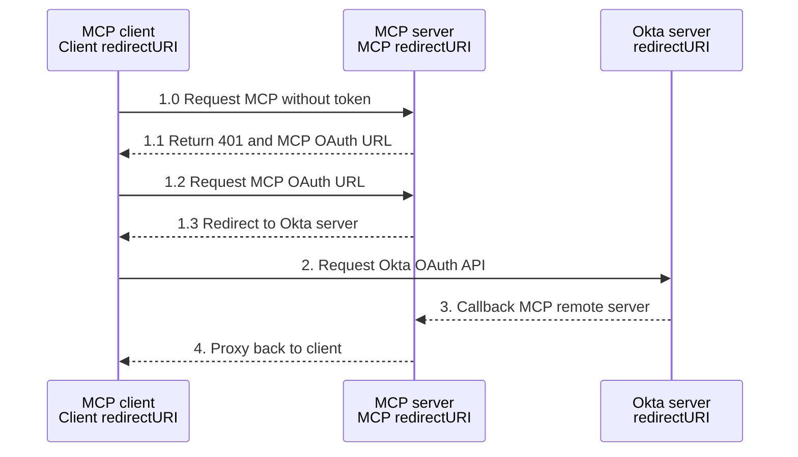

# OAuth 2.0 Authentication Architecture

This document outlines the OAuth 2.0 authentication architecture for the mcp-trino server, providing secure access control for AI assistants accessing Trino databases.

## Architecture Overview

The mcp-trino server implements OAuth 2.0 as a **resource server**, validating JWT tokens from clients while maintaining existing Trino authentication methods. This separation allows for flexible deployment scenarios.

### Key Components

```
┌─────────────────┐    ┌─────────────────┐    ┌─────────────────┐
│   AI Client     │    │   OAuth         │    │   MCP Server    │
│ (Claude Code /  │────│   Provider      │────│   (mcp-trino)   │
│  mcp-remote)    │    │ (Okta/Google/   │    │                 │
│                 │    │  Azure AD)      │    │                 │
└─────────────────┘    └─────────────────┘    └─────────────────┘
                                                       │
                                                       │
                                               ┌─────────────────┐
                                               │ Trino Database  │
                                               │ (Any Auth Type) │
                                               └─────────────────┘
```

### Okta Oauth workflow example


### Authentication Flow

1. **Client Authentication**: AI clients authenticate with OAuth provider
2. **Token Validation**: MCP server validates JWT tokens using OIDC/JWKS
3. **Database Access**: Server connects to Trino using configured authentication
4. **Authorization**: User context from JWT used for logging and access control

## Supported Authentication Modes

### 1. OIDC Provider Mode (Production)
- **Providers**: Okta, Google, Azure AD, and other OIDC-compliant providers
- **Validation**: JWKS-based signature verification with automatic key rotation
- **Configuration**: `OAUTH_PROVIDER=okta|google|azure`

### 2. HMAC-SHA256 Mode (Development/Testing)
- **Use Case**: Service-to-service authentication and testing
- **Validation**: Shared secret validation
- **Configuration**: `OAUTH_PROVIDER=hmac`

### 3. No Authentication Mode (Requires Explicit Configuration)
- **Use Case**: Local development and trusted environments
- **Configuration**: `TRINO_OAUTH_ENABLED=false` (explicitly required)

## Key Features

### Security Implementation
- **Token Logging**: JWT tokens logged as SHA256 hashes to prevent sensitive data exposure
- **JWT Secret Enforcement**: Server fails to start without JWT_SECRET in HMAC mode
- **Connection Error Sanitization**: Database passwords removed from error messages
- **Token Caching**: SHA256-based token validation caching (5-minute expiration)
- **PKCE Support**: Full OAuth 2.1 PKCE implementation for public clients
- **TLS Security**: Secure HTTP client configuration with proper certificate validation
- **Context Timeouts**: Proper timeout handling for all OAuth operations

### MCP Compliance
- **OAuth Metadata**: RFC 8414 compliant authorization server metadata endpoints
- **Dynamic Registration**: RFC 7591 dynamic client registration support
- **Resource Indicators**: RFC 8707 support for token audience specification
- **Bearer Token Validation**: OAuth 2.1 Section 5 compliant token validation

### Integration Points
- **Claude Code**: Native remote MCP server support with OAuth
- **mcp-remote**: Proxy support for Claude Desktop and other clients
- **HTTP Transport**: StreamableHTTP endpoint (`/mcp`) with backward compatibility (`/sse`)
- **Multiple Providers**: Configurable provider selection via environment variables

## Configuration

### Environment Variables

```bash
# OAuth Configuration (OAuth enabled by default)
TRINO_OAUTH_ENABLED=true     # Default: true (secure by default)
OAUTH_PROVIDER=okta          # hmac|okta|google|azure
JWT_SECRET=your-secret-key   # REQUIRED for HMAC mode (server fails without it)

# OIDC Provider Configuration
OIDC_ISSUER=https://your-domain.okta.com
OIDC_AUDIENCE=https://your-domain.okta.com
OIDC_CLIENT_ID=your-client-id

# MCP Server Configuration
MCP_TRANSPORT=http
MCP_PORT=8080
MCP_HOST=localhost

# HTTPS Configuration (Production)
HTTPS_CERT_FILE=/path/to/cert.pem
HTTPS_KEY_FILE=/path/to/key.pem
```

## Deployment Scenarios

### Development Setup
```bash
# HMAC mode for testing (JWT_SECRET required)
TRINO_OAUTH_ENABLED=true \
OAUTH_PROVIDER=hmac \
JWT_SECRET=development-secret \
MCP_TRANSPORT=http \
./mcp-trino

# Insecure mode (explicit opt-out)
TRINO_OAUTH_ENABLED=false \
MCP_TRANSPORT=http \
./mcp-trino
```

### Production Deployment
```bash
# OIDC mode with HTTPS
TRINO_OAUTH_ENABLED=true \
OAUTH_PROVIDER=okta \
OIDC_ISSUER=https://company.okta.com \
OIDC_AUDIENCE=https://mcp-server.company.com \
MCP_TRANSPORT=http \
HTTPS_CERT_FILE=/etc/ssl/certs/server.pem \
HTTPS_KEY_FILE=/etc/ssl/private/server.key \
./mcp-trino
```

### Client Configuration
```json
{
  "mcpServers": {
    "trino-oauth": {
      "url": "https://your-mcp-server.com/mcp",
      "headers": {
        "Authorization": "Bearer YOUR_JWT_TOKEN"
      }
    }
  }
}
```

## Benefits

- **Simplified Architecture**: OAuth complexity handled by clients (Claude Code/mcp-remote)
- **Flexible Authentication**: Works with any Trino authentication method
- **Production Ready**: Full OIDC support with proper security measures
- **MCP Compliant**: Implements OAuth 2.1 and MCP authorization specifications
- **Remote Deployment**: Supports distributed MCP server architecture
- **Multi-Provider**: Configurable OAuth provider support

## Security Considerations

- **Secure by Default**: OAuth enabled by default, requires explicit opt-out
- **JWT Secret Enforcement**: Server prevents startup without proper JWT secrets
- **Token Security**: JWT tokens logged as hashes to prevent exposure
- **Connection Security**: Database passwords sanitized from error messages
- **Token Validation**: Proper JWT signature verification with JWKS
- **HTTPS Required**: Production deployments must use HTTPS
- **Token Expiration**: Implement appropriate token lifetimes
- **Provider Trust**: Use established OAuth providers for production
- **Network Security**: Secure communication between all components
- **Audit Logging**: User actions logged with JWT claims for accountability

## Implementation Status

✅ **Complete OAuth 2.0 Implementation**
- Provider abstraction with HMAC and OIDC support
- Token validation middleware with caching
- OAuth flow handlers (authorize, token, callback)
- RFC-compliant metadata endpoints
- MCP server integration with HTTP transport
- HTTPS support for production deployments

The OAuth implementation is production-ready and supports major OAuth providers through a secure, standards-compliant architecture.

## Lessons Learned: Browser-Based MCP Client Compatibility

This section captures critical lessons learned while implementing OAuth for browser-based MCP clients like MCP Inspector and Chatwise.

### 1. OIDC Library Audience Configuration (Critical Bug)

**Problem**: JWT validation inconsistency between go-oidc library and custom validation.

**Root Cause**:
```go
// WRONG: go-oidc library was using ClientID for audience validation
verifier := provider.Verifier(&oidc.Config{
    ClientID: cfg.OIDCClientID,  // ❌ Used client ID instead of audience
})
```

**Solution**:
```go
// CORRECT: Use the configured audience for validation
verifier := provider.Verifier(&oidc.Config{
    ClientID: cfg.OIDCAudience,  // ✅ Use audience claim for validation
})
```

**Lesson**: The go-oidc library's `ClientID` field is used for audience validation, not client identification.

### 2. CORS Headers for Browser Access (Critical)

**Problem**: Browser-based MCP clients couldn't access OAuth endpoints due to CORS restrictions.

**Solution**: Add CORS headers to API endpoints (but not redirect endpoints):
```go
// API endpoints need CORS
w.Header().Set("Access-Control-Allow-Origin", "*")
w.Header().Set("Access-Control-Allow-Methods", "GET, HEAD, OPTIONS") // Specific per endpoint
w.Header().Set("Access-Control-Allow-Headers", "Authorization, *")
w.Header().Set("Access-Control-Max-Age", "86400")

// Handle OPTIONS preflight requests
if r.Method == "OPTIONS" {
    w.WriteHeader(http.StatusOK)
    return
}
```

**CORS-Enabled Endpoints**:
- `/.well-known/oauth-authorization-server` - Metadata discovery
- `/oauth/register` - Dynamic client registration
- `/oauth/token` - Token exchange

**No CORS Endpoints** (browser navigation):
- `/oauth/authorize` - Authorization redirect
- `/oauth/callback` - OAuth callback redirect

### 3. OAuth Discovery Response Format

**Problem**: MCP Inspector expected specific 401 response format for OAuth discovery.

**Solution**: Match established patterns (like Atlassian MCP):
```go
// Required WWW-Authenticate header format
w.Header().Set("WWW-Authenticate", fmt.Sprintf(
    `Bearer realm="OAuth", error="invalid_token", error_description="Missing or invalid access token"`))

// JSON response body
{"error":"invalid_token","error_description":"Missing or invalid access token"}
```

### 4. HTTP Method Security vs CORS Compatibility

**Best Practice**: Be honest about supported methods in CORS headers.
```go
// CORRECT: Advertise only what actually works
w.Header().Set("Access-Control-Allow-Methods", "POST, OPTIONS")
if r.Method != "POST" {
    http.Error(w, "Method not allowed", http.StatusMethodNotAllowed)
}
```

**Anti-Pattern**: Don't promise methods you don't support:
```go
// WRONG: Promise all methods but reject most
w.Header().Set("Access-Control-Allow-Methods", "*")
if r.Method != "POST" {
    http.Error(w, "Method not allowed", http.StatusMethodNotAllowed) // Inconsistent!
}
```

### 5. Multi-Client Testing Strategy

**Client Compatibility Testing**:
1. **Claude Code**: Native OAuth integration via mcp-remote
2. **MCP Inspector**: Browser-based OAuth discovery and flow
3. **Chatwise**: OAuth discovery recognition and flow initiation
4. **curl**: Manual endpoint and CORS testing

### 6. Security-First CORS Design

**Principles**:
- Only enable CORS on endpoints browsers call directly via fetch/XHR
- Use specific method lists, not wildcards unless actually supported
- Include `Authorization` header in allowed headers for JWT tokens
- Use appropriate cache control headers (`Access-Control-Max-Age`)

### Implementation Checklist

**Core OAuth Security**:
- [x] JWT audience validation (proper go-oidc configuration)
- [x] PKCE support for public clients
- [x] State parameter for CSRF protection
- [x] Method restrictions on endpoints

**Browser MCP Client Compatibility**:
- [x] CORS headers on API endpoints only
- [x] OPTIONS preflight request handling
- [x] Standard OAuth discovery response format
- [x] Compatible WWW-Authenticate header format
- [x] Specific method allowlists in CORS headers

**Multi-Client Support**:
- [x] Claude Code compatibility (mcp-remote)
- [x] MCP Inspector compatibility (browser-based)
- [x] Chatwise compatibility (OAuth discovery)
- [x] Dynamic client registration

### Common Pitfalls to Avoid

1. **go-oidc ClientID confusion**: Remember it's for audience validation
2. **CORS wildcard promises**: Don't advertise methods you don't support
3. **Missing preflight handling**: Always handle OPTIONS for CORS endpoints
4. **Inconsistent error formats**: Match what existing clients expect
5. **Redirect endpoint CORS**: These don't need CORS (browser navigation)