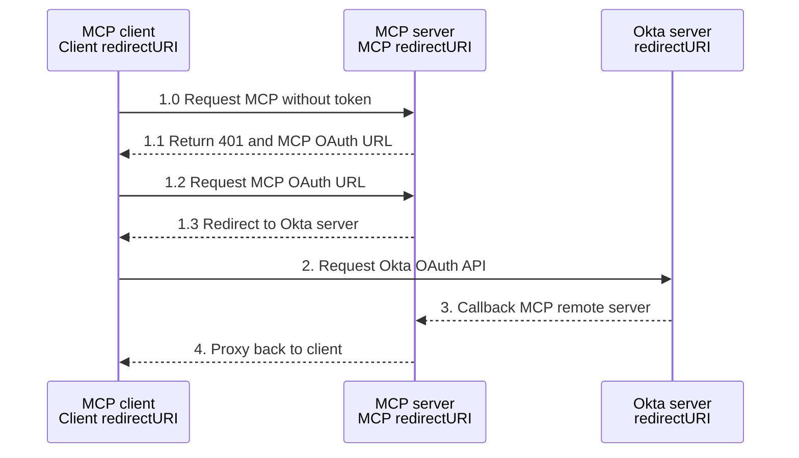

# OAuth 2.0 Authentication Architecture

This document outlines the OAuth 2.0 authentication architecture for the mcp-trino server, providing secure access control for AI assistants accessing Trino databases.

## Architecture Overview

The mcp-trino server implements OAuth 2.0 as a **resource server**, validating JWT tokens from clients while maintaining existing Trino authentication methods. This separation allows for flexible deployment scenarios.

### Key Components

```
┌─────────────────┐    ┌─────────────────┐    ┌─────────────────┐
│   AI Client     │    │   OAuth         │    │   MCP Server    │
│ (Claude Code /  │────│   Provider      │────│   (mcp-trino)   │
│  mcp-remote)    │    │ (Okta/Google/   │    │                 │
│                 │    │  Azure AD)      │    │                 │
└─────────────────┘    └─────────────────┘    └─────────────────┘
                                                       │
                                                       │
                                               ┌─────────────────┐
                                               │ Trino Database  │
                                               │ (Any Auth Type) │
                                               └─────────────────┘
```

### Okta Oauth workflow example


### Authentication Flow

1. **Client Authentication**: AI clients authenticate with OAuth provider
2. **Token Validation**: MCP server validates JWT tokens using OIDC/JWKS
3. **Database Access**: Server connects to Trino using configured authentication
4. **Authorization**: User context from JWT used for logging and access control

## Supported Authentication Modes

The MCP server supports two distinct OAuth operational modes to accommodate different deployment scenarios and client capabilities.

### OAuth Operational Modes

#### Native Mode (Direct OAuth)
**Architecture**: Client ↔ OAuth Provider directly, MCP server validates tokens only
- **Flow**: AI clients authenticate directly with OAuth provider (Okta, Google, etc.)
- **MCP Server Role**: Protected resource that validates bearer tokens
- **Client Configuration**: Requires client_id configuration in AI client
- **Security**: Most secure, no OAuth secrets stored in MCP server
- **Use Case**: Advanced clients like Claude.ai that support OAuth natively
- **Benefits**:
  - Zero OAuth secrets in MCP server environment
  - Direct provider relationship for clients
  - Simplified MCP server deployment
  - Better security isolation

#### Proxy Mode (OAuth Proxy)
**Architecture**: Client ↔ MCP Server ↔ OAuth Provider
- **Flow**: MCP server acts as OAuth proxy with pre-configured credentials
- **MCP Server Role**: OAuth authorization server proxy AND protected resource
- **Client Configuration**: Zero OAuth configuration needed in AI client
- **Security**: Requires client_secret in MCP server environment
- **Use Case**: Simple clients, centralized OAuth management, legacy compatibility
- **Benefits**:
  - No client-side OAuth configuration required
  - Centralized credential management
  - Compatible with any MCP client
  - Backward compatibility

### Provider-Specific Authentication

#### 1. OIDC Provider Mode (Production)
- **Providers**: Okta, Google, Azure AD, and other OIDC-compliant providers
- **Validation**: JWKS-based signature verification with automatic key rotation
- **Configuration**: `OAUTH_PROVIDER=okta|google|azure`
- **Modes**: Both Native and Proxy modes supported

#### 2. HMAC-SHA256 Mode (Development/Testing)
- **Use Case**: Service-to-service authentication and testing
- **Validation**: Shared secret validation
- **Configuration**: `OAUTH_PROVIDER=hmac`
- **Modes**: Proxy mode only (no external provider)

#### 3. No Authentication Mode (Requires Explicit Configuration)
- **Use Case**: Local development and trusted environments
- **Configuration**: `TRINO_OAUTH_ENABLED=false` (explicitly required)

## Key Features

### Security Implementation
- **Token Logging**: JWT tokens logged as SHA256 hashes to prevent sensitive data exposure
- **JWT Secret Enforcement**: Server fails to start without JWT_SECRET in HMAC mode
- **Connection Error Sanitization**: Database passwords removed from error messages
- **Token Caching**: SHA256-based token validation caching (5-minute expiration)
- **PKCE Support**: Full OAuth 2.1 PKCE implementation for public clients
- **TLS Security**: Secure HTTP client configuration with proper certificate validation
- **Context Timeouts**: Proper timeout handling for all OAuth operations

### MCP Compliance
- **OAuth Metadata**: RFC 8414 compliant authorization server metadata endpoints
- **Dynamic Registration**: RFC 7591 dynamic client registration support
- **Resource Indicators**: RFC 8707 support for token audience specification
- **Bearer Token Validation**: OAuth 2.1 Section 5 compliant token validation

### Integration Points
- **Claude Code**: Native remote MCP server support with OAuth
- **mcp-remote**: Proxy support for Claude Desktop and other clients
- **HTTP Transport**: StreamableHTTP endpoint (`/mcp`) with backward compatibility (`/sse`)
- **Multiple Providers**: Configurable provider selection via environment variables

## OAuth Configuration Guide

This section provides clear guidance on what configuration is needed for each OAuth mode and provider combination.

### 🔐 HMAC Provider (Self-Signed Tokens)

| Mode | JWT Secret on Server | Result | What This Means |
|------|---------------------|--------|-----------------|
| Native | ✅ Configured | ✅ **Ready to go** | Server can validate tokens from clients |
| Native | ❌ Missing | ❌ **Won't start** | Error: "JWT_SECRET is required when using HMAC provider" |
| Proxy | ✅ Configured | ✅ **Ready to go** | Server can issue tokens to clients |
| Proxy | ❌ Missing | ❌ **Won't start** | Error: "JWT_SECRET is required when using HMAC provider" |

### 🌐 External Providers (Okta, Google, Azure)

#### Native Mode - Client handles OAuth directly
| Server Has | OAuth App Auth Method | Client Must Have | Result | What Happens |
|------------|----------------------|------------------|--------|--------------|
| Issuer + Audience | **None** (Public) | Client ID + Endpoints | ✅ **Perfect** | PKCE flow, most secure for public clients |
| Issuer + Audience | **Client Secret** | Client ID + Secret + Endpoints | ✅ **Perfect** | Traditional confidential client flow |
| Issuer + Audience | Any method | **Only Client Secret** | ❌ **Invalid** | Client ID is always required |
| Issuer + Audience | Any method | **Neither ID nor Secret** | ❌ **Won't authenticate** | Client can't start OAuth flow |
| Missing Audience | Any method | Any client config | ❌ **Won't start** | Error: "OIDC_AUDIENCE is required for [provider]" |

#### Proxy Mode - Server handles OAuth for client
| OAuth App Auth Method | Server Configuration | Result | What This Means |
|-----------------------|---------------------|--------|-----------------|
| **None** (Public) | Client ID + Issuer + Redirect URIs | ✅ **Perfect** | Public client proxy with PKCE |
| **Client Secret** | Client ID + Secret + Issuer + Redirect URIs | ✅ **Perfect** | Confidential client proxy |
| **Client Secret** | Client ID + Missing Secret | ⚠️ **Will fail** | Mismatch: app expects secret but server missing it |
| **None** (Public) | Client ID + Secret provided | ⚠️ **Might work** | Secret ignored for public apps |
| Any method | Missing Client ID | ⚠️ **Broken** | Client identification impossible |

**⚠️ Currently Not Supported:**
- **Public Key/Private Key (JWT Client Assertion)** - Would require additional implementation

### 📋 Quick Decision Guide

**Choose Native Mode when:**
- Your client (Claude.ai, etc.) can handle OAuth
- You want maximum security (no secrets on server)
- Each user has their own OAuth app

**Choose Proxy Mode when:**
- Your client can't handle OAuth
- You want centralized credential management
- One OAuth app for all users

**HMAC Provider when:**
- You want simplest setup
- You trust your own token signing
- No external OAuth provider available

### 📝 OAuth App Authentication Methods

**None (Public Client):**
- **Okta Setting**: Client authentication = "None"
- **Security**: Uses PKCE (Proof Key for Code Exchange) for security
- **Use Case**: Mobile apps, SPAs, desktop applications that can't securely store secrets
- **Required**: Client ID only
- **Examples**: Claude Desktop app, browser-based clients

**Client Secret (Confidential Client):**
- **Okta Setting**: Client authentication = "Client Secret"
- **Security**: Client authenticates with secret during token exchange
- **Use Case**: Server-side applications that can securely store secrets
- **Required**: Client ID + Client Secret
- **Examples**: Web applications, server-to-server integrations

### ⚠️ **Important Configuration Matching**
Your MCP server configuration **must match** the OAuth app's authentication method:
- If Okta app uses "None" → Don't configure `OIDC_CLIENT_SECRET`
- If Okta app uses "Client Secret" → Must configure `OIDC_CLIENT_SECRET`

**Mismatch = Authentication Failure!**

### ❌ **Currently Not Supported**
**Public Key/Private Key (JWT Client Assertion):**
- **Okta Setting**: Client authentication = "Public Key/Private Key"
- **Status**: Not implemented in current version
- **Alternative**: Use "None" (public) or "Client Secret" authentication methods

## Implementation Plan for Dual OAuth Modes

Based on security review and architectural analysis, this plan prioritizes safety-first implementation with thorough validation.

### Phase 1: Configuration & Route Guarding (Security First)
**Objective**: Safely disable proxy functionality by default, ensure system runs securely in native-only mode.

#### 1.1: Configuration Structure
Add OAuth mode selection to configuration:
```go
// Add to internal/config/config.go
type TrinoConfig struct {
    // Existing fields...
    OAuthMode string `env:"OAUTH_MODE" envDefault:"native"` // "native" or "proxy"
}
```

#### 1.2: Conditional Route Registration
Wrap proxy-specific route registration in `internal/mcp/server.go`:
```go
// Only register proxy routes when in proxy mode
if s.config.OAuthMode == "proxy" {
    mux.HandleFunc("/oauth/authorize", s.oauthHandler.HandleAuthorize)
    mux.HandleFunc("/oauth/callback", s.oauthHandler.HandleCallback)
    mux.HandleFunc("/oauth/token", s.oauthHandler.HandleToken)
    mux.HandleFunc("/oauth/register", s.oauthHandler.HandleRegister)
    mux.HandleFunc("/callback", s.oauthHandler.HandleCallbackRedirect)
}
// Discovery endpoints always available for both modes
```

#### 1.3: Handler Mode Detection (Defense in Depth)
Add mode checks at handler level as secondary safety:
```go
func (h *OAuth2Handler) HandleAuthorize(w http.ResponseWriter, r *http.Request) {
    if h.config.OAuthMode == "native" {
        http.Error(w, "OAuth proxy disabled in native mode", http.StatusNotFound)
        return
    }
    // Existing proxy logic...
}
```

**Outcome**: System guaranteed to run safely in native-only mode with proxy code path completely disabled.

### Phase 2: Conditional Metadata & JWKS Handling
**Objective**: Implement correct discovery documents and token validation for both modes.

#### 2.1: Conditional Metadata Responses
Modify `GetAuthorizationServerMetadata()` in `internal/oauth/metadata.go`:

**Native Mode**: Point to OAuth provider directly
```json
{
    "issuer": "https://company.okta.com",
    "authorization_endpoint": "https://company.okta.com/oauth2/v1/authorize",
    "token_endpoint": "https://company.okta.com/oauth2/v1/token",
    "registration_endpoint": "https://company.okta.com/oauth2/v1/clients",
    "jwks_uri": "https://company.okta.com/.well-known/jwks.json"
}
```

**Proxy Mode**: Point to MCP server endpoints
```json
{
    "issuer": "https://your-mcp-server.com",
    "authorization_endpoint": "https://your-mcp-server.com/oauth/authorize",
    "token_endpoint": "https://your-mcp-server.com/oauth/token",
    "registration_endpoint": "https://your-mcp-server.com/oauth/register",
    "jwks_uri": "https://your-mcp-server.com/.well-known/jwks.json"
}
```

#### 2.2: JWKS Proxy Endpoint
Implement `/.well-known/jwks.json` endpoint for proxy mode:
```go
func (h *OAuth2Handler) HandleJWKS(w http.ResponseWriter, r *http.Request) {
    if h.config.OAuthMode == "native" {
        http.Error(w, "JWKS endpoint disabled in native mode", http.StatusNotFound)
        return
    }
    // Proxy JWKS from upstream OAuth provider
}
```

#### 2.3: Conditional Logout Endpoint
Add logout endpoint for proxy mode:
```go
func (h *OAuth2Handler) HandleLogout(w http.ResponseWriter, r *http.Request) {
    if h.config.OAuthMode == "native" {
        http.Error(w, "Logout endpoint disabled in native mode", http.StatusNotFound)
        return
    }
    // Clear MCP session and redirect to upstream logout
}
```

**Outcome**: Clients can correctly discover configuration for either mode with proper JWKS handling.

### Phase 3: Foundational Security Implementation
**Objective**: Implement core security foundation for IP-whitelisted private deployment.

#### 3.1: Essential Security Foundation
Core security requirements for `internal/oauth/handlers.go`:

**HTTPS Enforcement** (Critical for OAuth):
```go
func (s *Server) enforceHTTPS(next http.HandlerFunc) http.HandlerFunc {
    return func(w http.ResponseWriter, r *http.Request) {
        if !r.TLS && s.config.OAuthMode == "proxy" {
            log.Printf("SECURITY: Rejected non-HTTPS OAuth request from %s", r.RemoteAddr)
            http.Error(w, "HTTPS required for OAuth endpoints", http.StatusBadRequest)
            return
        }
        next(w, r)
    }
}

// Apply HTTPS enforcement to OAuth endpoints
mux.HandleFunc("/oauth/authorize", s.enforceHTTPS(s.oauthHandler.HandleAuthorize))
mux.HandleFunc("/oauth/callback", s.enforceHTTPS(s.oauthHandler.HandleCallback))
mux.HandleFunc("/oauth/token", s.enforceHTTPS(s.oauthHandler.HandleToken))
```

**Secure Session Configuration**:
```go
func (h *OAuth2Handler) storeState(w http.ResponseWriter, state string) {
    cookie := &http.Cookie{
        Name:     "oauth_state",
        Value:    state,
        HttpOnly: true,                    // Prevent XSS access
        Secure:   true,                    // HTTPS only
        SameSite: http.SameSiteStrictMode, // CSRF protection
        MaxAge:   300,                     // 5 minutes expiration
        Path:     "/oauth",                // Scope to OAuth endpoints only
    }
    http.SetCookie(w, cookie)
}
```

**Basic CSRF Protection**:
```go
func (h *OAuth2Handler) HandleCallback(w http.ResponseWriter, r *http.Request) {
    returnedState := r.FormValue("state")
    if !h.validateState(r, returnedState) {
        log.Printf("SECURITY: Invalid state parameter from %s", r.RemoteAddr)
        http.Error(w, "Invalid request", http.StatusBadRequest)
        return
    }
    // Continue callback processing...
}
```

**Basic Input Validation**:
```go
func (h *OAuth2Handler) validateOAuthParams(r *http.Request) error {
    // Basic length validation to prevent abuse
    if code := r.FormValue("code"); len(code) > 512 {
        return fmt.Errorf("invalid parameter length")
    }
    if state := r.FormValue("state"); len(state) > 256 {
        return fmt.Errorf("invalid state parameter")
    }
    return nil
}
```

**Redirect URI Allowlist** (Essential):
```go
func (h *OAuth2Handler) isValidRedirectURI(uri string) bool {
    // Validate against pre-configured allowlist
    allowedURIs := strings.Split(h.config.AllowedRedirectURIs, ",")
    for _, allowed := range allowedURIs {
        if strings.TrimSpace(uri) == strings.TrimSpace(allowed) {
            return true
        }
    }
    return false
}
```

#### 3.2: Basic Security Headers
Add essential security headers:
```go
func (h *OAuth2Handler) addSecurityHeaders(w http.ResponseWriter) {
    w.Header().Set("X-Content-Type-Options", "nosniff")
    w.Header().Set("X-Frame-Options", "DENY")
    w.Header().Set("Cache-Control", "no-store, no-cache, max-age=0")
    w.Header().Set("Pragma", "no-cache")
}
```

#### 3.3: Minimal Testing & Validation
**Essential Tests**:
- **HTTPS Enforcement**: Verify HTTP requests are rejected in proxy mode
- **State Validation**: Confirm CSRF protection works
- **Redirect URI Validation**: Test allowlist enforcement
- **Basic OAuth Flow**: End-to-end proxy mode functionality

**Deferred for IP-Whitelisted Deployment**:
- Rate limiting (IP whitelist provides DoS protection)
- Advanced audit logging (basic logging sufficient)
- Comprehensive input validation (trusted internal clients)
- Penetration testing (internal deployment, lower priority)

#### 3.4: Client Configuration Documentation
Document different client setup requirements:

**Native Mode Client Setup**:
```json
{
  "mcpServers": {
    "trino-native": {
      "url": "https://mcp-server.company.com/mcp",
      "oauth": {
        "issuer": "https://company.okta.com",
        "client_id": "your-claude-oauth-app-client-id",
        "scopes": ["openid", "profile", "email"]
      }
    }
  }
}
```

**Proxy Mode Client Setup**:
```json
{
  "mcpServers": {
    "trino-proxy": {
      "url": "https://mcp-server.company.com/mcp"
    }
  }
}
```

**Outcome**: Proxy mode is thoroughly validated, secure, and ready for production use.

## Configuration

### Environment Variables

```bash
# OAuth Configuration (OAuth enabled by default)
TRINO_OAUTH_ENABLED=true     # Default: true (secure by default)
OAUTH_MODE=native            # native|proxy (Default: native)
OAUTH_PROVIDER=okta          # hmac|okta|google|azure
JWT_SECRET=your-secret-key   # REQUIRED for HMAC mode (server fails without it)

# OIDC Provider Configuration (Both Modes)
OIDC_ISSUER=https://your-domain.okta.com
OIDC_AUDIENCE=https://your-domain.okta.com

# Proxy Mode OAuth Configuration (Proxy Mode Only)
OIDC_CLIENT_ID=your-client-id      # OAuth application client ID
OIDC_CLIENT_SECRET=your-secret     # OAuth application client secret
OAUTH_REDIRECT_URI=https://your-mcp-server.com/oauth/callback
OAUTH_ALLOWED_REDIRECT_URIS=https://client1.com/callback,https://client2.com/callback  # Security: Allowlist for redirect URIs

# MCP Server Configuration
MCP_TRANSPORT=http
MCP_PORT=8080
MCP_HOST=localhost
MCP_URL=https://your-mcp-server.com  # Used in OAuth metadata

# HTTPS Configuration (Production)
HTTPS_CERT_FILE=/path/to/cert.pem
HTTPS_KEY_FILE=/path/to/key.pem
```

## Deployment Scenarios

### Development Setup

#### Native Mode Development
```bash
# Native mode with HMAC (for testing token validation only)
TRINO_OAUTH_ENABLED=true \
OAUTH_MODE=native \
OAUTH_PROVIDER=hmac \
JWT_SECRET=development-secret \
MCP_TRANSPORT=http \
./mcp-trino
```

#### Proxy Mode Development
```bash
# Proxy mode with HMAC (full OAuth flow testing)
TRINO_OAUTH_ENABLED=true \
OAUTH_MODE=proxy \
OAUTH_PROVIDER=hmac \
JWT_SECRET=development-secret \
MCP_TRANSPORT=http \
./mcp-trino
```

#### Insecure Development
```bash
# Insecure mode (explicit opt-out)
TRINO_OAUTH_ENABLED=false \
MCP_TRANSPORT=http \
./mcp-trino
```

### Production Deployments

#### Native Mode Production (Recommended)
```bash
# Native mode with Okta - most secure
TRINO_OAUTH_ENABLED=true \
OAUTH_MODE=native \
OAUTH_PROVIDER=okta \
OIDC_ISSUER=https://company.okta.com \
OIDC_AUDIENCE=https://mcp-server.company.com \
MCP_URL=https://mcp-server.company.com \
MCP_TRANSPORT=http \
HTTPS_CERT_FILE=/etc/ssl/certs/server.pem \
HTTPS_KEY_FILE=/etc/ssl/private/server.key \
./mcp-trino
```

#### Proxy Mode Production
```bash
# Proxy mode with Okta - requires OAuth secrets
TRINO_OAUTH_ENABLED=true \
OAUTH_MODE=proxy \
OAUTH_PROVIDER=okta \
OIDC_ISSUER=https://company.okta.com \
OIDC_AUDIENCE=https://mcp-server.company.com \
OIDC_CLIENT_ID=your-oauth-app-client-id \
OIDC_CLIENT_SECRET=your-oauth-app-client-secret \
OAUTH_REDIRECT_URI=https://mcp-server.company.com/oauth/callback \
MCP_URL=https://mcp-server.company.com \
MCP_TRANSPORT=http \
HTTPS_CERT_FILE=/etc/ssl/certs/server.pem \
HTTPS_KEY_FILE=/etc/ssl/private/server.key \
./mcp-trino
```

### Client Configuration Examples

#### Native Mode Client Configuration
```json
{
  "mcpServers": {
    "trino-native": {
      "url": "https://mcp-server.company.com/mcp",
      "oauth": {
        "client_id": "your-claude-oauth-app-client-id",
        "scopes": ["openid", "profile", "email"]
      }
    }
  }
}
```

#### Proxy Mode Client Configuration
```json
{
  "mcpServers": {
    "trino-proxy": {
      "url": "https://mcp-server.company.com/mcp"
    }
  }
}
```

### Mode Selection Guide

**Choose Native Mode When**:
- Using Claude.ai, Perplexity, or other OAuth-capable AI clients
- Maximum security is required (no OAuth secrets in MCP server)
- Direct OAuth provider relationship is preferred
- MCP server deployment should be minimal
- **Recommended for production deployments**

**Choose Proxy Mode When**:
- Using simple MCP clients without OAuth support
- Centralized OAuth management is required
- Legacy compatibility is needed
- Client-side OAuth configuration should be avoided
- **Note**: Requires IP whitelisting and HTTPS for secure deployment

## Benefits

- **Simplified Architecture**: OAuth complexity handled by clients (Claude Code/mcp-remote)
- **Flexible Authentication**: Works with any Trino authentication method
- **Production Ready**: Full OIDC support with proper security measures
- **MCP Compliant**: Implements OAuth 2.1 and MCP authorization specifications
- **Remote Deployment**: Supports distributed MCP server architecture
- **Multi-Provider**: Configurable OAuth provider support

## Security Considerations

### Core Security Requirements (Both Modes)
- **Secure by Default**: OAuth enabled by default, requires explicit opt-out
- **JWT Secret Enforcement**: Server prevents startup without proper JWT secrets
- **Token Security**: JWT tokens logged as hashes to prevent exposure
- **Connection Security**: Database passwords sanitized from error messages
- **Token Validation**: Proper JWT signature verification with JWKS
- **HTTPS Required**: Production deployments must use HTTPS
- **Token Expiration**: Implement appropriate token lifetimes
- **Provider Trust**: Use established OAuth providers for production

### Proxy Mode Additional Security
- **IP Whitelisting Required**: Proxy mode should only be accessible from trusted networks
- **HTTPS Enforcement**: All OAuth endpoints must reject HTTP requests
- **CSRF Protection**: State parameter validation prevents cross-site attacks
- **Redirect URI Allowlist**: Prevent open redirect vulnerabilities
- **Secure Session Cookies**: HttpOnly, Secure, SameSite attributes required
- **Basic Input Validation**: Parameter length limits to prevent abuse

### Network Security Architecture
```
Trusted Network (IP Whitelisted)
┌─────────────────────────────────────────────────────────────┐
│  ┌─────────────────┐    HTTPS    ┌─────────────────┐       │
│  │   AI Client     │────────────▶│   MCP Server    │       │
│  │ (Claude.ai /    │             │   (mcp-trino)   │       │
│  │  Internal Tool) │             │  Proxy Mode     │       │
│  └─────────────────┘             └─────────────────┘       │
│                                            │                │
│                                    HTTPS   │                │
│                                            ▼                │
│                                   ┌─────────────────┐       │
│                                   │ OAuth Provider  │       │
│                                   │ (Okta/Google)   │       │
│                                   └─────────────────┘       │
└─────────────────────────────────────────────────────────────┘

Blocked: Public Internet Access ❌
```

### Deployment Security Checklist
**Pre-Deployment**:
- [ ] IP whitelisting configured at network/firewall level
- [ ] HTTPS certificates installed and validated
- [ ] OAuth redirect URI allowlist configured
- [ ] OAuth provider credentials secured

**Runtime Monitoring**:
- [ ] Monitor for HTTPS enforcement violations
- [ ] Log OAuth authentication failures
- [ ] Audit successful authentications
- [ ] Monitor for invalid redirect URI attempts

## Implementation Status

✅ **Complete OAuth 2.0 Implementation**
- Provider abstraction with HMAC and OIDC support
- Token validation middleware with caching
- OAuth flow handlers (authorize, token, callback)
- RFC-compliant metadata endpoints
- MCP server integration with HTTP transport
- HTTPS support for production deployments

The OAuth implementation is production-ready and supports major OAuth providers through a secure, standards-compliant architecture.

## Lessons Learned: Browser-Based MCP Client Compatibility

This section captures critical lessons learned while implementing OAuth for browser-based MCP clients like MCP Inspector and Chatwise.

### 1. OIDC Library Audience Configuration (Critical Bug)

**Problem**: JWT validation inconsistency between go-oidc library and custom validation.

**Root Cause**:
```go
// WRONG: go-oidc library was using ClientID for audience validation
verifier := provider.Verifier(&oidc.Config{
    ClientID: cfg.OIDCClientID,  // ❌ Used client ID instead of audience
})
```

**Solution**:
```go
// CORRECT: Use the configured audience for validation
verifier := provider.Verifier(&oidc.Config{
    ClientID: cfg.OIDCAudience,  // ✅ Use audience claim for validation
})
```

**Lesson**: The go-oidc library's `ClientID` field is used for audience validation, not client identification.

### 2. CORS Headers for Browser Access (Critical)

**Problem**: Browser-based MCP clients couldn't access OAuth endpoints due to CORS restrictions.

**Solution**: Add CORS headers to API endpoints (but not redirect endpoints):
```go
// API endpoints need CORS
w.Header().Set("Access-Control-Allow-Origin", "*")
w.Header().Set("Access-Control-Allow-Methods", "GET, HEAD, OPTIONS") // Specific per endpoint
w.Header().Set("Access-Control-Allow-Headers", "Authorization, *")
w.Header().Set("Access-Control-Max-Age", "86400")

// Handle OPTIONS preflight requests
if r.Method == "OPTIONS" {
    w.WriteHeader(http.StatusOK)
    return
}
```

**CORS-Enabled Endpoints**:
- `/.well-known/oauth-authorization-server` - Metadata discovery
- `/oauth/register` - Dynamic client registration
- `/oauth/token` - Token exchange

**No CORS Endpoints** (browser navigation):
- `/oauth/authorize` - Authorization redirect
- `/oauth/callback` - OAuth callback redirect

### 3. OAuth Discovery Response Format

**Problem**: MCP Inspector expected specific 401 response format for OAuth discovery.

**Solution**: Match established patterns (like Atlassian MCP):
```go
// Required WWW-Authenticate header format
w.Header().Set("WWW-Authenticate", fmt.Sprintf(
    `Bearer realm="OAuth", error="invalid_token", error_description="Missing or invalid access token"`))

// JSON response body
{"error":"invalid_token","error_description":"Missing or invalid access token"}
```

### 4. HTTP Method Security vs CORS Compatibility

**Best Practice**: Be honest about supported methods in CORS headers.
```go
// CORRECT: Advertise only what actually works
w.Header().Set("Access-Control-Allow-Methods", "POST, OPTIONS")
if r.Method != "POST" {
    http.Error(w, "Method not allowed", http.StatusMethodNotAllowed)
}
```

**Anti-Pattern**: Don't promise methods you don't support:
```go
// WRONG: Promise all methods but reject most
w.Header().Set("Access-Control-Allow-Methods", "*")
if r.Method != "POST" {
    http.Error(w, "Method not allowed", http.StatusMethodNotAllowed) // Inconsistent!
}
```

### 5. Multi-Client Testing Strategy

**Client Compatibility Testing**:
1. **Claude Code**: Native OAuth integration via mcp-remote
2. **MCP Inspector**: Browser-based OAuth discovery and flow
3. **Chatwise**: OAuth discovery recognition and flow initiation
4. **curl**: Manual endpoint and CORS testing

### 6. Security-First CORS Design

**Principles**:
- Only enable CORS on endpoints browsers call directly via fetch/XHR
- Use specific method lists, not wildcards unless actually supported
- Include `Authorization` header in allowed headers for JWT tokens
- Use appropriate cache control headers (`Access-Control-Max-Age`)

### Implementation Checklist

**Core OAuth Security**:
- [x] JWT audience validation (proper go-oidc configuration)
- [x] PKCE support for public clients
- [x] State parameter for CSRF protection
- [x] Method restrictions on endpoints

**Browser MCP Client Compatibility**:
- [x] CORS headers on API endpoints only
- [x] OPTIONS preflight request handling
- [x] Standard OAuth discovery response format
- [x] Compatible WWW-Authenticate header format
- [x] Specific method allowlists in CORS headers

**Multi-Client Support**:
- [x] Claude Code compatibility (mcp-remote)
- [x] MCP Inspector compatibility (browser-based)
- [x] Chatwise compatibility (OAuth discovery)
- [x] Dynamic client registration

### Common Pitfalls to Avoid

1. **go-oidc ClientID confusion**: Remember it's for audience validation
2. **CORS wildcard promises**: Don't advertise methods you don't support
3. **Missing preflight handling**: Always handle OPTIONS for CORS endpoints
4. **Inconsistent error formats**: Match what existing clients expect
5. **Redirect endpoint CORS**: These don't need CORS (browser navigation)